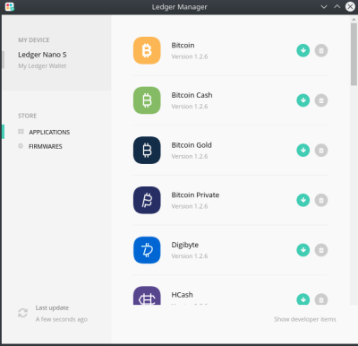
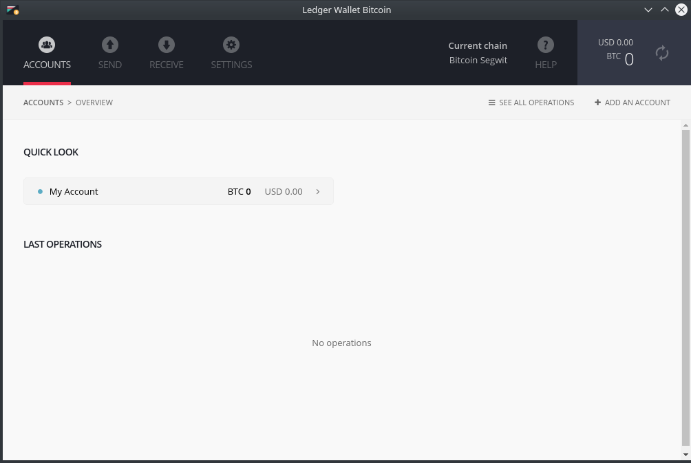
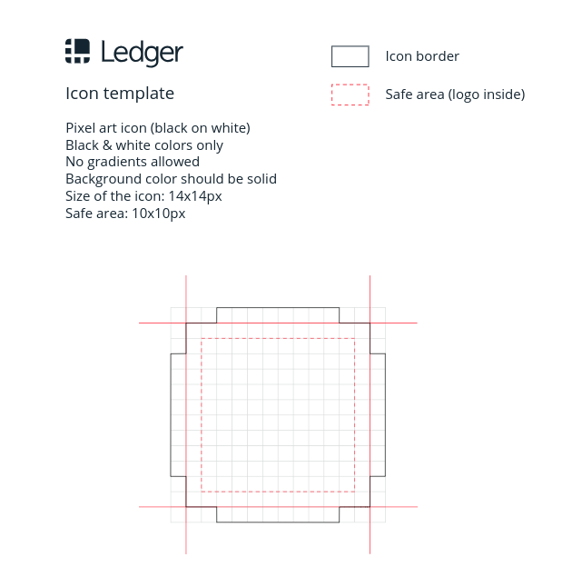
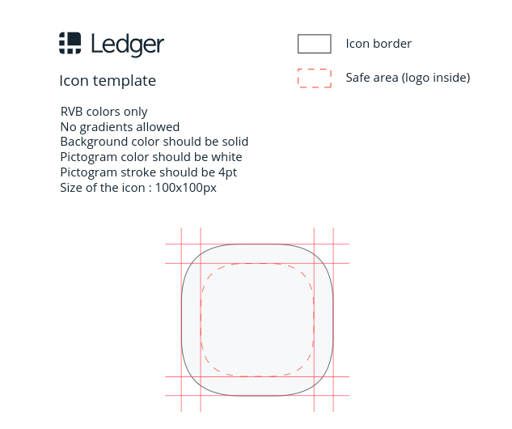

Publishing an Application
=========================
The Ledger Manager is the service which centralizes the distribution of:doc:`BOLOS </bolos/introduction>` applications on Ledger devices. It is the place where both Ledger's apps and third party apps are distributed to users.
This document aims at explaining the procedure for a third party app to be released on the Ledger Manager.

   The Ledger Manager - Chrome App

First, let's see the typical end-to-end architecture of a BOLOS application, in
the case of an app for a cryptocurrency:

.. figure:: images/app_architecture.png
   :align: center

   End-to-end architecture of a BOLOS application

In this example, 3 pieces of software are required:

1. A BOLOS application, written in C, running on a Ledger device
2. The companion app, with business logic and typically a GUI, running on a
   computer or a phone connected to the Ledger device
3. A transaction explorer that interfaces between the front-end and the
   cryptocurrency daemon, running either locally (in the case of a full node) or
   remotely (light wallet)

If you're not developing an app adding support for a cryptocurrency, then you
can ignore the 3rd piece. Depending on your use case, the companion app might be a simple daemon or a command line tool, without a GUI.

   Ledger's Bitcoin Companion App - Chrome App

When these pieces are ready for deployment, they must be sent to Ledger for
a security review. One of the things we're going to do is review the security of the BOLOS
application code, and check that it functions as intended in conjunction with
its companion app. Here is a non-exhaustive list of what we're looking at
during the review process:

* Backdoors
* Buffer overflows
* Correct use of the device (for example, minimizing :ref:`NVRAM wearing
  <flash-memory-endurance>`)
* Correct use of the SDK
* Application stability, correct handling of errors
* Correct usability (see `Design Guidelines`_)

Review time depends on Ledger’s available resources and code complexity. The more unique and complex the code, the longer the review. Please note that forks of supported BOLOS apps will require a new review. The decision to reject or revoke an app is at Ledger’s sole discretion. We will make our best efforts to provide a rationale for such decisions. Upon fixing identified issues, app authors will be allowed to re-submit their apps.   
Ledger is currently in the process of moving away from its own companion apps
(Bitcoin, Ethereum, and Ripple chrome apps) as Google is going to deprecate
Chrome apps in 2018. A new all-in-one native app will be released on the 9th of
July, 2018. This new platform will be open to pull requests for adding support
for new cryptocurrencies. You still have the choice to build your own companion 
app with its own backend but this solution is more resource intensive. On the 
other hand, it gives you more freedom on the design of the interface you want 
users to see, and the way it will be implemented (Web app? Native app? It's up 
to you!).

Design Guidelines 
-----------------

The design of your device app will be added to our website to inform that your app is 
available. In that respect, we thank you to provide us with the design in a format and 
with measurements that shall meet the criteria communicated by our team. 

There are 2 mandatory icons that should be provided for Ledger to release an app:

- The Device icon, displayed on the Nano S dashboard
- The Manager icon, displayed in the Manager application list

Below are the templates for such icons, please respect their guidance.

   Device icon template

   Manager icon template

Most of the time, Bolos apps expose few functionalities to the user. However, 
despite this simplicity, it is still challenging to build a user-friendly 
interface, because of the few inputs (only 2 buttons !) and also because of 
the screen size which offer only 128*32 pixels.
Ledger provides some guidance to avoid third party developers to reinvent 
the wheel. 

.. note:: 

    See the :doc:`BAGL Toolkit</userspace/display_management>` for more information 
    on the BOLOS Application Graphics Library technical details.  

Even though the screen is small, you don't want to bloat it with plenty of tiny text
to fit everything in a single time. Instead, multiple successives screens are the 
way to go, with a configurable time interval between each screen switch.
Doing this allows you to split and segment the information to display.
It is also a good practice to inform the user of what is the kind of information 
currently displayed, by giving it a title.
In some cases, even when the information is segmented by type, there won't be 
enough space for it to fit entirely on screen. Rather than splitting this information 
in multiple screens, it is better to use automatic scrolling display.
Here is an example that sums it up:

.. figure:: images/scroll.gif
   :align: center

   Example: transaction confirmation screen

On this example two informations are shown: an amount of bitcoins, and a destination 
address. The two screens are alternating periodically until the user validates or cancel.
A title is present to describe each information. For the too-long-to-display destination 
address, the automatic scrolling is used.

A few graphical pointers (glyphs) help users to make a link between the right and left 
buttons and their effects.
There are four principal functions fulfilled by pressing buttons: 

- Making a binary choice for a question asked by the device (1 button)
- Moving in a menu (1 button)
- Selecting a menu entry (2 buttons)
- Proceeding with a disclaimer (2 buttons)

To propose a binary choice to the user, 2 glyphs representing the 2 choices should be 
placed on each side of the screen (a cross symbol to cancel and a validation symbol to 
accept). 
You can display a question and relevant information in between the glyphs, like in the 
upper example.

To move inside a menu, be it vertical or horizontal, the same technique is applied with 
different glyphs. We recommend using arrows: up and down for a vertical menu, left and 
right for a horizontal one).

Once positioned on the right menu entry, the user can select the entry by pressing both 
buttons. This potential action is not represented by glyphs.
Same goes when going through a set of disclaimer screens: only text is displayed, and 
the user goes to the next part by pressing both buttons.
This is a consistent behavior across the device, so you can assume that users are used 
to it. It should feel obvious when the user has to press two buttons to go through 
something in your app.

Ledger does not impose the icons nor the interface for third party applications, however user 
friendliness and guidelines compliance is something being reviewed during the integration process. 
Therefore, a very poor design might be a cause of delay in your release roadmap if the 
outcome of the review is negative because of it. Don't neglect it !

Design Warranty 
---------------

The design of your device app shall free from any encumbrances and shall not infringe upon any third party intellectual property right, in particular trademark and design rights. You grant Ledger the right to use such design for free with the right to reproduce and exploit the design for the duration of its display on Ledger website.

You represent and warrant that the device app you are making available on Ledger Live is in compliance with all relevant laws and regulations.

You agree to hold Ledger harmless of any claim arising out of the use of the design and or distribution of the device app .

Release Roadmap
---------------

Ledger is going to release new cryptocurrency apps for its devices on the first
Tuesday of each month. Once an app is ready to be deployed, it is packed with
the others and released in bulk.

From the day an external team starts working on a new app, Ledger will add it to
its `public Trello roadmap <https://trello.com/b/5nQ1mdzt/ledger-roadmap>`_. The
same goes for apps being built by Ledger itself. Once your coin is listed on our
Trello page, the Ledger community will start asking questions about the project.
Feel free to answer them, as Ledger itself doesn't usually have the answers to
questions about third party projects. This is also your space to keep the
community up to date.

Third Party Applications Support
--------------------------------

.. note::

   The following only applies if you are adding support for a cryptocurrency and
   chose to build your own companion app.

Ledger does not provide support for third party applications. Instead, we
provide a small guide (see `example
<https://support.ledgerwallet.com/hc/en-us/articles/360005288614-Install-and-use-Nimiq>`_) on Ledger's official website
that shows the basics:

* How to install the app on a Ledger device
* A link to find more information

This is why it is required for third party teams to provide a link to a complete
tutorial that will guide users. Along with your publication request and app code, 
please provide information that will allow the Ledger support team to redirect 
users to relevant support resources:

* Identity: Name, Surname, Legal Entity
* Point of Contact: URL, email address, phone number

Contact
-------
External developer teams are welcome on `Ledger's Developer Slack
<https://www.ledger.fr/developers/>`_. This is the place to get technical
support, to discuss Ledger's tech stack, and more broadly to get in touch with
us.

Warranty and liability disclaimer
---------------------------------

The review and publication of third-party Ledger device applications (collectively “the Service”) are provided by Ledger on an “as-is” and “as-available” basis. The Service is subject to change without notice. Ledger disclaims all warranties of accuracy, non-infringement, merchantability and fitness for a particular purpose. To the extent that Ledger makes any pre-release of Ledger device applications available to third-party developers, you understand that Ledger is under no obligation to provide updates, enhancements, or corrections, or to notify you of any changes that Ledger may make, or to publicly announce or introduce the Ledger device applications at any time in the future. 

To the extent not prohibited by applicable law, in no event will Ledger be liable for personal injury, or any incidental, special, indirect, consequential or punitive damages whatsoever, including, without limitation, damages resulting from delay of delivery, for loss of profits, data, business or goodwill, for business interruption, or any other commercial damages or losses, arising out of or related to this agreement or your use or inability to use the service.

