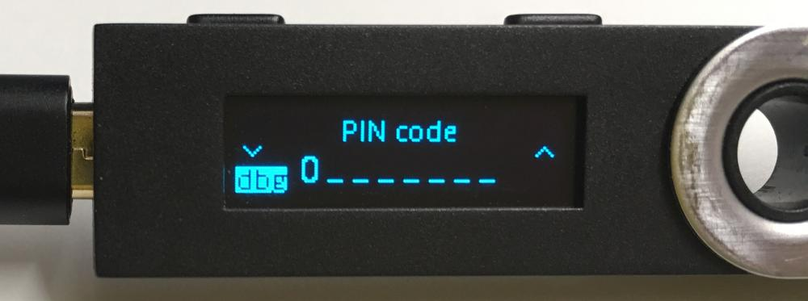
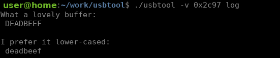

Application Debug
=================

.. note::

   Ledger is currently working on more solutions to improve the coding experience on its products.
   In particular, a development board and an emulator are in the pipe, but there is not yet an estimated time of arrival for these.

.. warning::

   The :doc:`BOLOS development environment </userspace/getting_started>` is required for the following article. It applies only for the Nano S, with its latest firmware firmware (1.4.2).

It is possible to install a debugging firmware on the device's MCU that will enable printing text outputs from the device to a terminal. To do so, follow these steps: 

1. First, download the `updater <https://drive.google.com/open?id=16vFH70jxsJ1D-SjyXkpnXhSk1KGe_iPD>`_ and the `debug firmware <https://drive.google.com/open?id=1CQJg6Txvuiez0re3becKiI4PEgY-Xs4v>`_ .

2. Now, plug your Nano S to your computer while keeping the left button pressed. Keep it pressed until the screen displays ``BOOTLOADER``.

3. Fire a terminal and move to the directory containing the files downloaded at step 1.

4. Exit any instance of Ledger Live, Ledger Chrome App, or any other program able to communicate with a Ledger device.

5. Install the updater: 
``python -m ledgerblue.loadMCU --targetId 0x01000001 --fileName blup_0.8_misc_m1.hex --nocrc``
Wait until ``BOOTLOADER`` is displayed again on the device's screen.

6. Install the debug firmware: 
``python -m ledgerblue.loadMCU --targetId 0x01000001 --fileName mcu_1.6-printf_over_bl_0.8.hex`` 
``--reverse --nocrc``

If you can notice a small ``dbg`` block at the bottom of the screen, then it's a success !

   A Nano S with special debug firmware

PRINTF macro
------------

The debug firmware enables the ``PRINTF`` macro, however you have to define it in your app's Makefile.
To do so, add this line in your Makefile: 
``DEFINES   += HAVE_SPRINTF HAVE_PRINTF PRINTF=screen_printf``

Usually, ``PRINTF`` is already defined to void with this line ``DEFINES   += PRINTF\(...\)=``.
Check if ``PRINTF`` is already defined somewhere else in your Makefile, and comment out this definition so it doesn't override the one that we just set.

.. warning::

   The PRINTF macro is a debugging feature, and as such it is not intended for use in production.
   When compiling an application for release purpose, please verify that ``PRINTF`` is disabled in your Makefile. In other words, in case of release compilation, put back the line ``DEFINES   += PRINTF\(...\)=`` and comment out the other one.

.. warning::
   The PRINTF macro can only be used in between successive calls to ``io_exchange``. Calling it outside of it will result in unexpected behavior.

This macro can be used in your code like a classical ``printf`` function from ``stdio.h``.
However, it is improved with a neat feature to easily print byte arrays:

.. code-block:: c++

   uint8_t buffer[4] = {0xDE, 0xAD, 0xBE, 0xEF};

   // PRINTF(string, array length, array); 
   // .*H for uppercase, .*h for lowercase
   PRINTF("What a lovely buffer:\n %.*H \n\n", 4, buffer);
   PRINTF("I prefer it lower-cased:\n %.*h \n", 4, buffer);

   Result of the example code printed inside a terminal

Console Printing
----------------

The ``PRINTF`` macro triggers messages from the MCU to the host computer through the USB link. We use `USBTool <https://drive.google.com/open?id=16D5vlrbczmBxqpDJml6QUV0RGWs7aZeZ>`_ to read these messages and print their payload in a terminal. 

Unzip the file and execute this command: ``./usbtool -v 0x2c97 log``

Now you can launch your app on your Nano S, and every ``PRINTF`` will end up printed on the host computer, allowing you to debug your program more easily.
